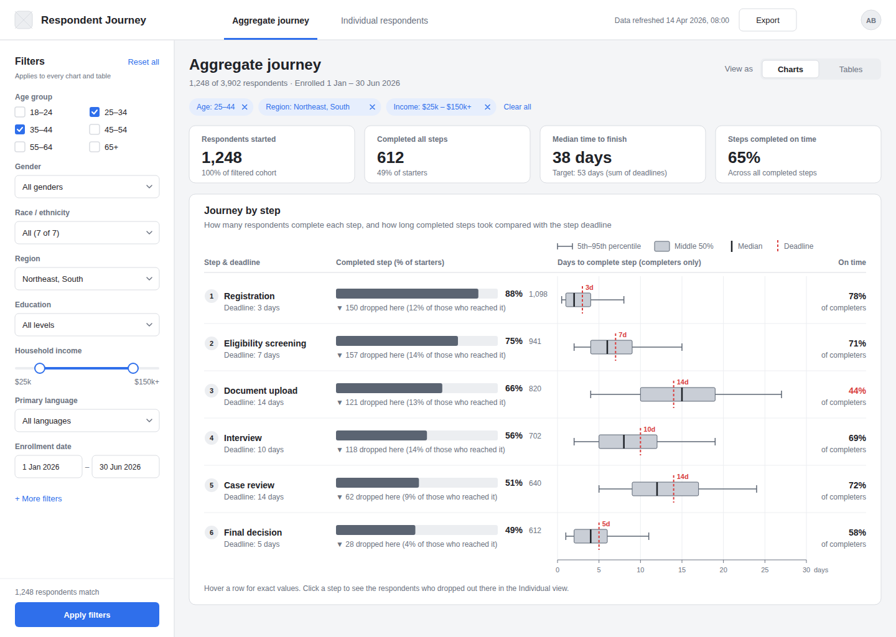
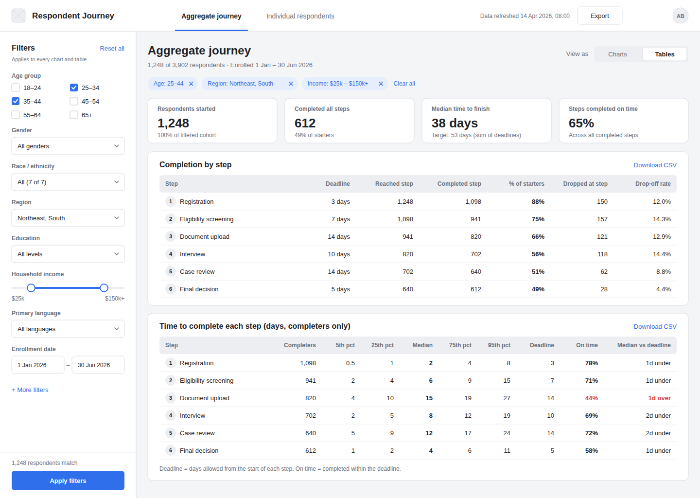
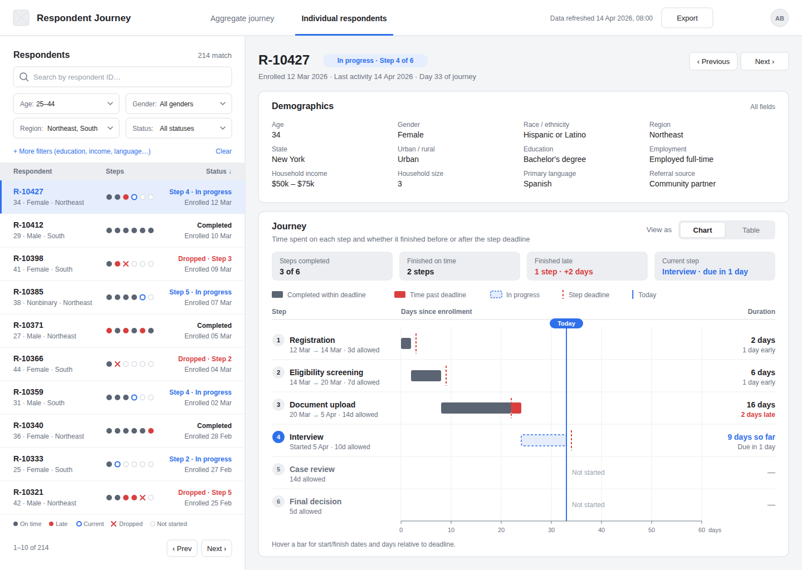
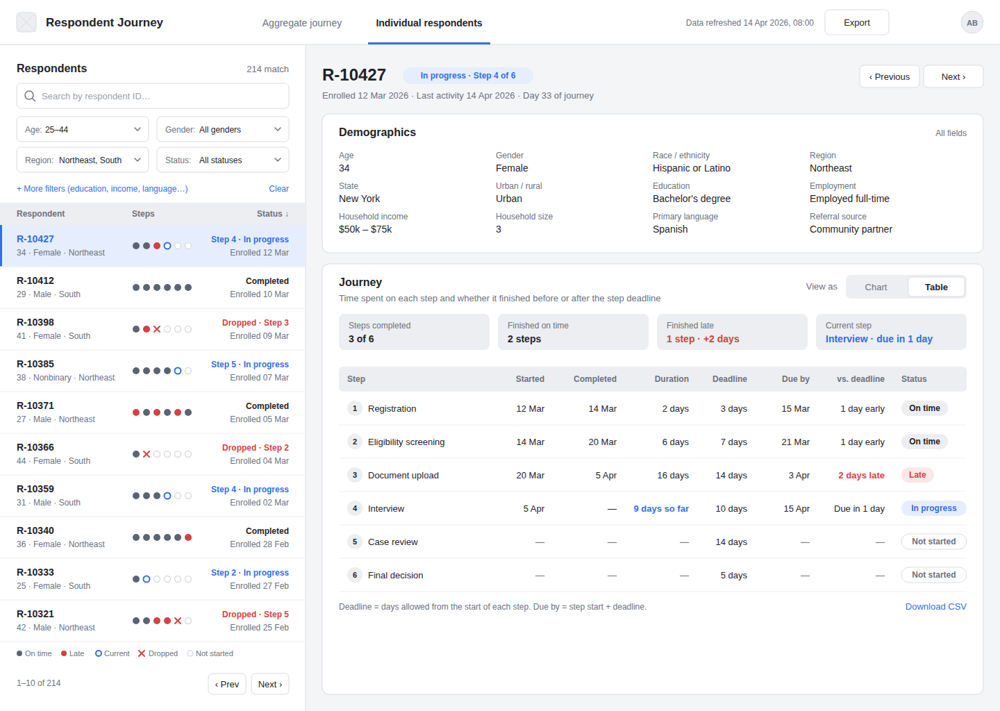

# Respondent Journey Dashboard: wireframes

Low-fidelity wireframes for a dashboard that follows respondents through a six-step process
(Registration → Eligibility screening → Document upload → Interview → Case review → Final decision).
There are two screens, and each has a chart state and a table state, so there are four frames in total:

| Frame | File |
|---|---|
| 1a. Aggregate journey, charts | `svg/01-aggregate-charts.svg` |
| 1b. Aggregate journey, tables | `svg/02-aggregate-tables.svg` |
| 2a. Individual respondent, chart | `svg/03-individual-chart.svg` |
| 2b. Individual respondent, table | `svg/04-individual-table.svg` |

Each frame is 1440 × 1024. Open `index.html` to see all four side by side.

## Getting them into Figma

1. In Figma, create a page (e.g. "Wireframes").
2. Drag the four `.svg` files onto the canvas, or open a file in a text editor, copy the contents and paste into Figma.
3. Each SVG comes in as a frame. Text stays editable, and every UI element is a named layer group
   (e.g. `Filter sidebar › Filter / Region`, `Journey by step (chart) › Step 3 / Document upload`),
   so you can restyle or convert pieces to components.

The SVGs use Inter. Install it (or let Figma substitute a font) to get the intended spacing.

## Screen 1: Aggregate journey

- **Demographic filters** (left sidebar): age group, gender, race/ethnicity, region, education,
  household income, primary language, enrollment date, plus "More filters". Applied filters also
  appear as removable chips above the content. Filters apply to every KPI, chart and table on the page.
- **Charts / Tables toggle** (top right) switches the whole page between the two frames.
- **KPI tiles**: starters, completed all steps, median time to finish vs. the target (sum of deadlines),
  and the share of steps completed on time.
- **Journey by step** is one row per step, aligned across three columns:
  - *Completed step*: a funnel bar showing the share of starters who completed the step, plus how many dropped
    out at that step and what fraction of those who reached it that is.
  - *Days to complete*: a box plot of time spent on the step (5th–95th percentile whiskers, IQR box, median),
    with the step's deadline as a red dashed line. You can see at a glance which steps usually run past their
    deadline (e.g. Document upload).
  - *On time*: the share of completers who finished within the deadline.
- **Tables state**: "Completion by step" (reached, completed, % of starters, dropped, drop-off rate) and
  "Time to complete each step" (percentiles, deadline, % on time, median vs. deadline). Each table has a CSV download.

## Screen 2: Individual respondents

- **Left panel**: search by ID, demographic filters (age, gender, region, status, and "More filters"), and a
  paginated list of matching respondents. Each row shows the ID, a one-line demographic summary, a six-dot step
  indicator (on time / late / current / dropped / not started) and a status. The selected row is highlighted.
- **Header**: respondent ID, status badge, enrollment/last-activity dates, and Previous/Next buttons for stepping through the filtered list.
- **Demographics card**: all demographic fields for the selected respondent.
- **Journey card**:
  - Summary tiles: steps completed, on time, late (with total days late) and current step.
  - **Chart state**: a timeline where each step is a bar in days since enrollment. The dark part is time within
    the deadline, the red part is time past it, and a red dashed tick marks each step's due date. The in-progress
    step is a dashed accent bar running up to the "Today" line. Steps not yet reached are labelled "Not started".
    The right column gives the duration and how many days early or late the step finished.
  - **Table state**: step, started, completed, duration, deadline, due by, days vs. deadline and a status pill
    (On time / Late / In progress / Not started).
  - **Chart / Table toggle** in the card header.

## Conventions

- Greyscale wireframe with one accent (blue) for interactive and selected elements and current progress, and one alert
  colour (red) for deadlines and lateness. Lateness is never shown by colour alone: it is always labelled in text too.
- All numbers are placeholders chosen to be internally consistent (e.g. funnel counts match the drop-off figures).

## Regenerating

The frames are generated from `generate.py` (Python 3, standard library only):

```sh
python3 wireframes/generate.py
```

Edit the mock data or layout constants at the top of the script and run it again.

## Previews





